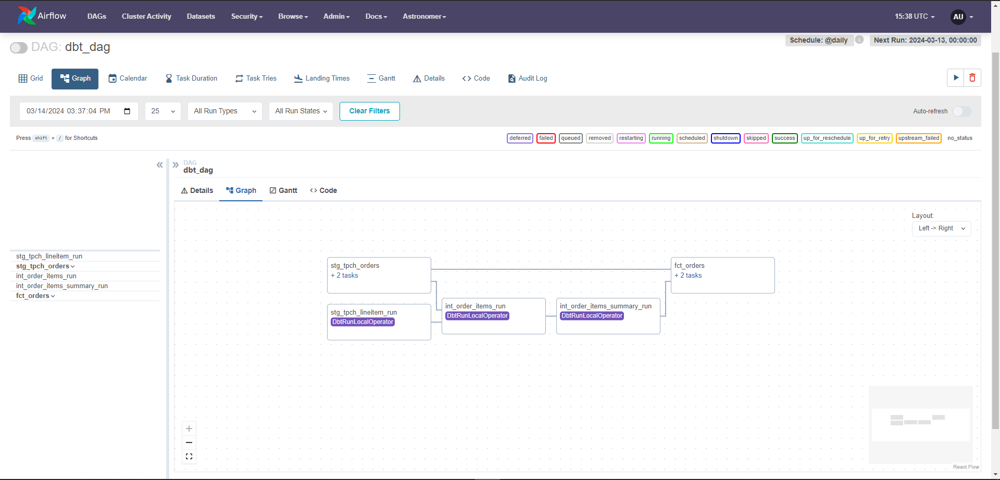

# A datawarehouse project made with modern tools 

## Tech stack
- Dbt (works very well in the T of ELT)
- Snowflake (serves as our data warehouse)
- Airflow & Cosmos (orchestration)

## Project Workflow:

- Snowflake:
    Used snowflake as a datawarehouse. Created databases, designed schema, created roles in snowflake.
- Dbt:
    Install dbt-core in my local machine, configured dbt_project.yml and profiles.yml to connect dbt-core with snowflake.
    Structured staging and source models. 
    Designed fact tables and data marts. Used dbt marcros to achieve code reusability.
    Wrote generic and singular tests.
- Airflow: 
    Used the astro-cli to spin up a local development aiflow environment to work in.
    Overwrite the dockerfile to specifiy docker images and install required dev dependencies. 
    We need the cosmos library to integrate dbt jobs into airflow. Cosmos can automatically create airflow task/task group from dbt models.
    Built dbt DAG using cosmos's dbtDAG class to create a DAG based on the dbt models.

And by running `astro dev start` the airflow UI pops up where you can trigger your dbt dags manually or schedule your jobs as you please.
It should look like this

    

